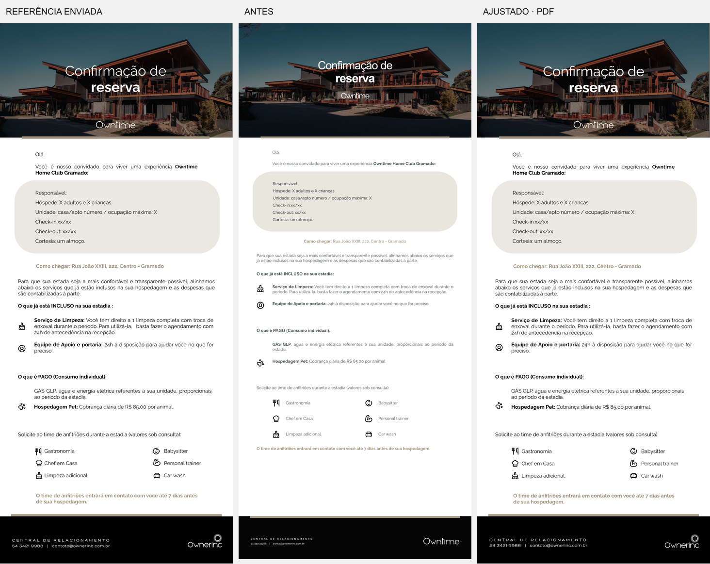

# Cards Pós Owner — comparação com Frame 2 (5)

Referência fornecida pelo usuário: `Frame 2 (5).png`, **1448 × 3361 px**.

As três colunas usam a mesma largura: referência, exportação anterior e nova
exportação. A altura anterior é ligeiramente diferente porque sua proporção
era 862 × 1984. A imagem comparativa contém apenas o conteúdo padrão do modelo.

## Ajustes realizados

- Prancheta Owner corrigida para 1448 × 3361; PDF de 108 × 250,68 mm.
- Capa com recorte medido, escurecimento e posição do título e da marca.
- Raleway e preto no corpo, sem interferência da tipografia/cor do shell.
- Caixa da reserva com posição, dimensões, raio e entrelinha da referência.
- Endereço dourado integralmente em negrito; títulos, seções, serviços em duas
  colunas e mensagem dos anfitriões reposicionados.
- Logo **Ownerinc** correto no rodapé; marca **Owntime** na capa.
- Os campos continuam editáveis. Valores já salvos continuam prevalecendo
  sobre os defaults; uma marca personalizada é apresentada como texto.
- Capa personalizada continua usando sua própria mídia, com recorte `cover`
  centralizado. O ajuste específico da foto padrão não se aplica aos uploads.
- Exportação na resolução nativa, aproximadamente 341 dpi na largura física,
  evitando o custo de um canvas de 4344 × 10083 em celulares.

## Marcos de comparação

Coordenadas em pixels da prancheta completa. Os valores de texto usam line-boxes
do navegador, enquanto a inspeção do PNG identifica a tinta dos glifos.

| Marco geométrico | Referência | Exportação ajustada |
|---|---|---|
| Fim da foto / início do corpo | y 711 | y 711 |
| Caixa da reserva | x 90, y 977, 1277 × 455 | x 90, y 976,95, 1277 × 455 |
| Início do rodapé preto | y 3067 | y 3067 |
| Logo Ownerinc | aproximadamente x 1168, y 3180, 211 × 80 visíveis | asset em x 1167, y 3180, 212 × 83 |
| Mensagem dos anfitriões | duas linhas junto ao rodapé | duas linhas; line-box y 2918,77 |

Foi calculado o erro absoluto médio dos canais RGB contra a referência na
resolução 1448 × 3361. Para essa métrica, a imagem anterior foi redimensionada
à mesma prancheta; a diferença de proporção faz parte do erro anterior.

| Região | Antes (0–255) | Depois (0–255) |
|---|---:|---:|
| Prancheta completa | 18,468 | 5,328 |
| Capa | 28,447 | 7,899 |
| Corpo | 13,233 | 4,565 |
| Rodapé | 36,289 | 5,221 |

O erro médio total caiu aproximadamente **71%**. Isso é uma medida de diferença
de pixels, não um percentual de identidade visual. Ainda existem diferenças
finas na rasterização das fontes, ícones, foto e no posicionamento de alguns
glifos: não se afirma identidade pixel a pixel com o PNG original.

## Verificação

- Playwright com Chrome 153, módulos/frontend/exportadores reais e autenticação
  simulada localmente; PDFs efetivamente baixados.
- Prancheta exportada comparada em viewports 1680, 768, 390 e 320 px. Desktop e
  tablet produziram o mesmo canvas; celulares tiveram erro médio de canal de
  apenas 0,0000123/255 contra desktop, sem alteração geométrica.
- Sem overflow horizontal nos viewports testados.
- Prévia nativa capturada separadamente da imagem produzida por html2canvas.
- Fluxos de erro de upload, imagem inválida, repetição do mesmo arquivo e PDF
  com foto padrão/personalizada passaram para Convidado e Owner.
- Teste de geometria PDF atualizado para os dois modelos e larguras de viewport.
- Marca e saudação editadas no formulário, preservadas ao alternar modelos;
  restauração da marca padrão e download de PDF editado aprovados.
- PDF final inspecionado: uma página, MediaBox equivalente a 108 × 250,68 mm,
  aproximadamente 1,69 MB.
- `npm run verify`: **537 testes aprovados**, sem falhas ou skips.
- `git diff --check`: aprovado.

Comparações de navegador são locais. Este documento não registra deploy nem
homologação desta composição em produção.

## Correção posterior da visualização em telas pequenas

Após a publicação, o usuário relatou que a arte não cabia inteira na tela.
Os testes anteriores comparavam o canvas exportado e o overflow horizontal;
não verificavam se o rodapé da prévia ficava dentro da altura visível.

O cálculo da prévia agora desconta o padding do container e respeita largura
e altura em todos os tamanhos de tela. O editor desktop usa a área efetivamente
disponível abaixo da topbar. Em telas até 900 px, a prévia aparece antes do
formulário e sua altura considera o espaço restante na tela.

- **Arte inteira**: padrão, exibe o card completo, incluindo rodapé.
- **Ampliar**: usa a largura disponível e libera rolagem para ler os detalhes.
- Os controles alteram apenas a prévia; exportação e proporções da arte são
  preservadas. A volta do histórico recalcula o espaço disponível.

Playwright/Chrome verificou os limites reais da arte e do rodapé, ampliação,
rolagem, retorno à arte inteira e histórico em 1366 × 768, 1024 × 600,
900 × 600, 768 × 1024, 390 × 844, 320 × 568 e 844 × 390, nos dois modelos.
Em paisagem muito baixa, a página pode exigir rolagem até a prévia; a arte
cabe inteira nesse viewport. Edição inline mobile e PDFs nos dois modos
também passaram, sem erros JS.
